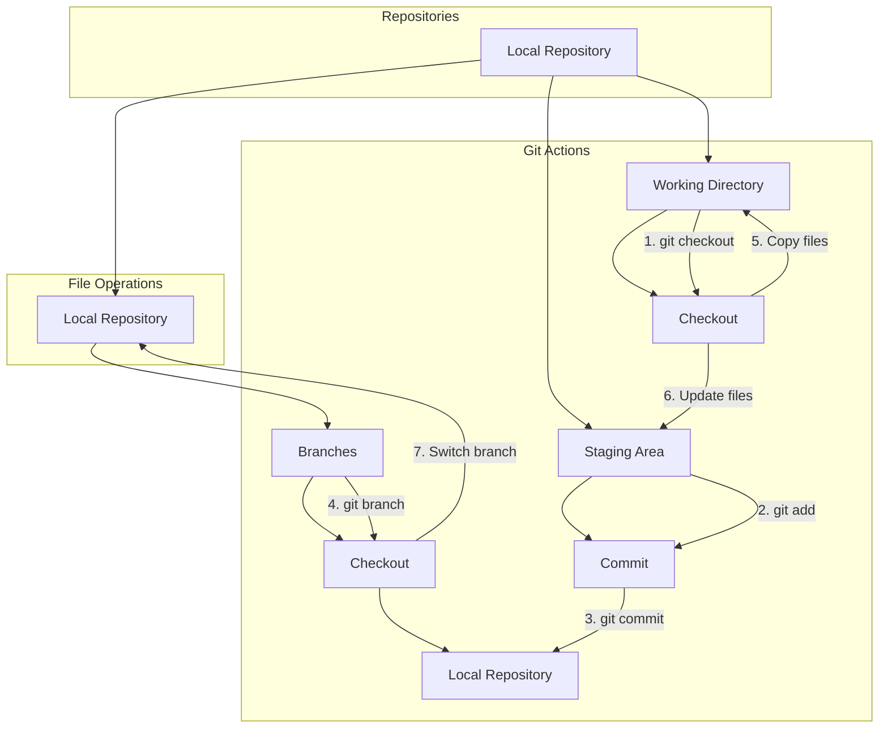

# Getting Started with Git

Welcome to the first part of your Git and GitHub learning journey. In this section, we will cover the basics of Git, from installation to your first repository.

## Table of Contents

1. [Introduction to Git](#introduction-to-git)
2. [Installation](#installation)
3. [Configuration](#configuration)
4. [Creating Your First Repository](#creating-your-first-repository)
5. [Basic Git Commands](#basic-git-commands)
6. [Working with Git](#working-with-git-section).

## Introduction to Git

Git is a distributed version control system that allows developers to track changes in their code, collaborate with others, and manage different versions of a project. It is essential for maintaining a structured development workflow and ensuring code stability.

## Installation

To get started with Git, you'll need to install it on your local machine. Follow these steps to install Git:

- **Windows:** Download the installer from [Git for Windows](https://gitforwindows.org/) and follow the installation instructions.

- **macOS:** On macOS, Git is often pre-installed. Open the terminal and type `git --version` to check if it's available. If not, you can install it using [Homebrew](https://brew.sh/).

- **Linux:** Use your distribution's package manager to install Git. For example, on Ubuntu, you can run `sudo apt install git`.

## Configuration

Before you start using Git, you need to configure your identity, which includes your name and email address. Open your terminal or command prompt and set your Git username and email with the following commands:

```bash
git config --global user.name "Your Name"
git config --global user.email "youremail@example.com"
```

These settings will be used to identify you as the author of your commits.

## Creating Your First Repository

Now that Git is installed and configured, it's time to create your first Git repository:

1. **Navigate to your project directory:** Use the `cd` command to go to the directory where your project is located.

2. **Initialize a Git repository:** Run the following command to create a Git repository for your project:

   ```bash
   git init
   ```

3. **Add your project files:** Use the `git add` command to stage your project files for the initial commit. For example, to stage all files, you can use:

   ```bash
   git add .
   ```

4. **Make your first commit:** Commit the staged changes with a descriptive message using the `git commit` command:

   ```bash
   git commit -m "Initial commit"
   ```

## Basic Git Commands

Now that your repository is set up, here are some fundamental Git commands you'll frequently use:

- `git status`: Check the status of your repository, showing which files are modified, staged, or untracked.

- `git log`: View a history of commits.

- `git branch`: List existing branches in your repository.
  ```mermaid
  gitGraph
       commit
       commit
       branch develop
       commit
       commit
       commit
       checkout main
       commit
       commit
   ```

- `git checkout <branch-name>`: Switch to a different branch.

- `git pull`: Fetch changes from a remote repository and merge them into your current branch.

- `git push`: Push your local changes to a remote repository.

### Git Operations


Continue your Git journey by exploring [2_Getting_Started_with_GitHub.md](2_Getting_Started_with_GitHub.md) to understand how Git integrates with GitHub for efficient collaboration and version control.
